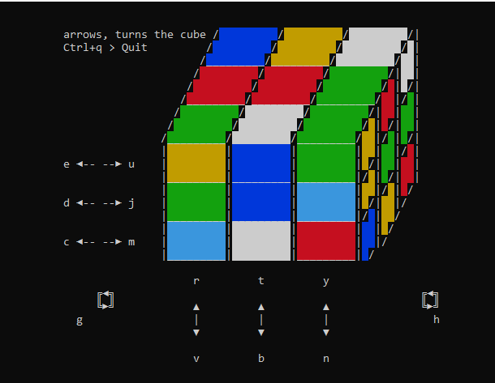

# rubics-cube

## Description
A practice in use programing with a class.... it's the class'ic Rubics Cube.

## Visuals

## Installation
Clone.
run the command 'npm install'
start by running 'npm start'

## Usage
Uses the npm packages keypress and process. These are included in the package.json.

## Bugs and support
Please contact me throught discord, slack or student email. In that prefered order.

## Roadmap
- [x] Make a cube in the terminal window.
- [x] Have complete set of manipulations.
- [x] Keyboard controll
- [ ] Loading / Saving
- [ ] (Better) graphics
- [ ] As a webservice?
- [ ] Music?

## Contributing

I welcome feedback on the project and colab on the project... 
Apart from above mentioned improvements, 
the toString function is a horror and needs rework.

## Authors and acknowledgment

- ॐ नमः शिवाय
- Sir Terry Pratchett, becuase Terry should always be acknowledged.
- Douglas Adams, becuase Douglas should always be acknowledged.
- The Omnissiah is from the 40k universe and are the ip of Games Workshop Limited.

## License
MIT
